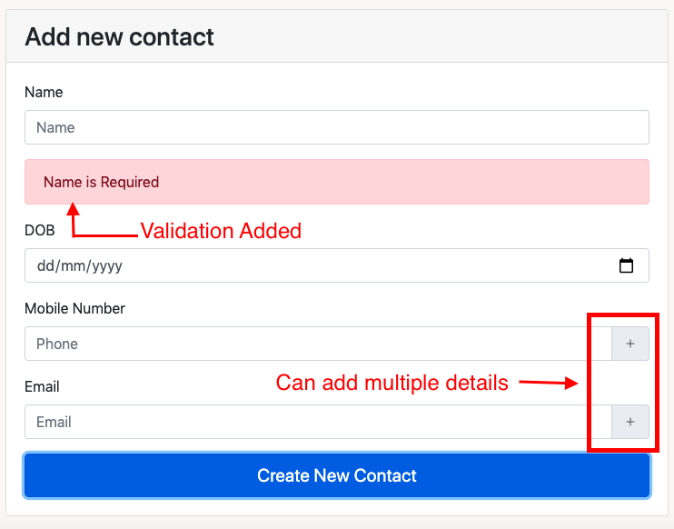
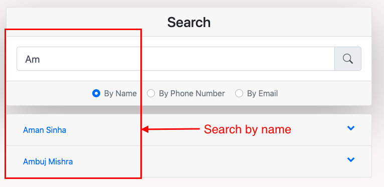
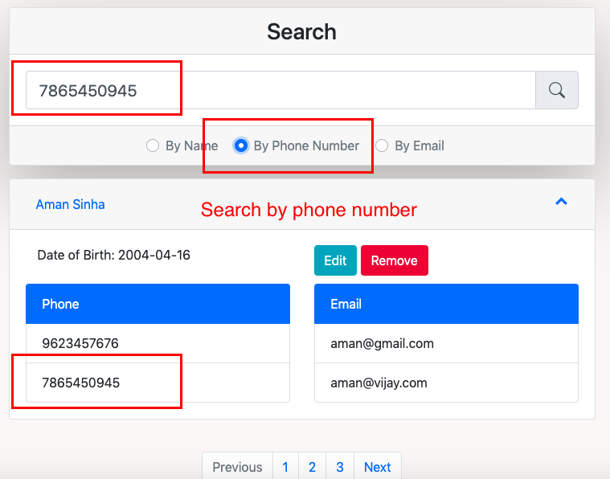
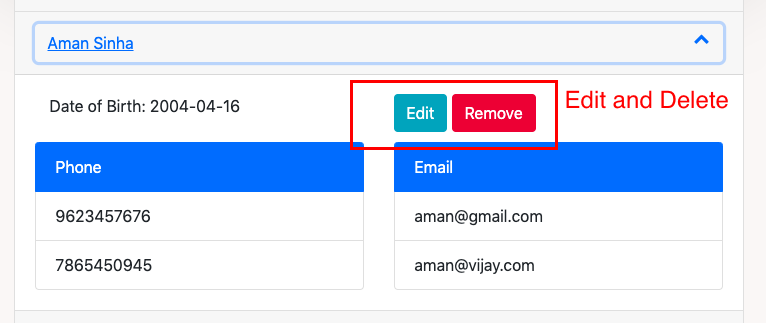

# Phone Book App

Backend uses NodeJs. Database on MongoDB, used cloud based version of MongoDB database called MongoAtlas to store data on cloud. Project hosted on [Heruko](https://obscure-lake-53008.herokuapp.com/).
https://obscure-lake-53008.herokuapp.com/
## Commands

Install dependencies using:

```bash
npm install
```
Start the server

```bash
npm start
```
## Application Features/Components

1. Add new Contacts : 



2. Search :




3. Edit/Delete :



4. Pagination :

